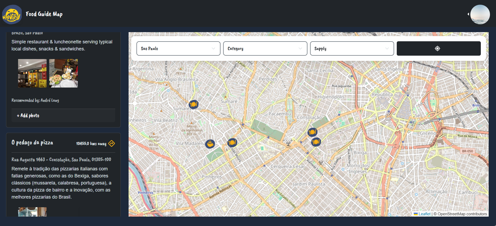
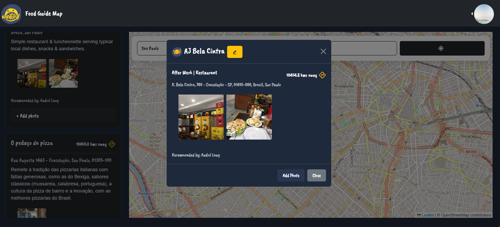

# 🍔 Hangry Food Guide Map App


*Map — Main view showing markers and sidebar*


*Map 2 - Displaying other places of the selected city*


*Detail of a place selected*  


*Admin users may edit and approve the rendering of a place or not*

An app that acts as a food guide for those moments when you're "hangry" 😤🍕 but don't know where to eat or just need some coffee/tea ☕.

## 🛠️ Technical Requirements

- 🔥 All data is fetched, created, and updated using Firebase.
- 🗺️ OpenStreetMap (via Leaflet) displays food places from the Firebase Firestore database.
- 📱 Responsive design.
- 🧩 Component-based architecture.
- 🚦 Uses React Router for navigation.
- 💾 Utilizes Firebase Firestore, Authentication, and Storage.
- 📊 Implements React Table for tabular data.
- 📝 Utilizes React Hook Form for form handling.
- 📍 Integrates OpenStreetMap + Nominatim (geocoding) for location-based features.
- 🏗️ Adheres to the principle of separating API communication into intermediate layers.
- 🎨 Uses Bootstrap and SCSS for UI styling.

### 👥 Users Can

- 🗺️ View nearby restaurants on a map and in a list.
- 📋 Access detailed information about a restaurant, including address, location, description, category, range, contact details, and online presence.
- 🔍 Filter restaurants by category and range.
- 📍 Search for restaurants based on their location.
- 🌆 Enter a city to display restaurants (useful when GPS is not available).
- 🔤 Sort the restaurant list by name.
- 📌 See their own position on the map.
- 🔎 Search for restaurants by typing in a location (with autocomplete).
- ⭐ Recommend new places to eat.

### 📋 Prerequisites

- 💻 Node.js and npm installed locally.
- 🔥 Firebase project configured with Firestore, Authentication, and Storage.

### 👨‍💼 Administrators Can

- ✏️ Perform CRUD (Create, Read, Update, Delete) operations on restaurants.
- 📝 Manage user-submitted tips.
- 👤 View a table of all administrators and users, including profile pictures (if available).
- 🔧 Update their own profiles, including name, profile image URL, email, and password.

⚠️ Please note: Searches for restaurants are restricted to selected locations.

## 🌱 Seed Firestore (real places)

This repo includes a seed script that (by default) fetches real place POIs from OpenStreetMap (Overpass API) and inserts them into the `places` collection for:
- `Sao Paulo`
- `Malmö`
- `Copenhagen`

It uses the Firebase Admin SDK (service account) and **does not** commit any secrets.

### 1) Create a Firebase service account key

In Firebase Console → Project settings → Service accounts → Generate new private key.
Save it somewhere outside the repo (for example `C:\secrets\serviceAccount.json`).

### 2) Run the seed script (PowerShell)

```powershell
$env:GOOGLE_APPLICATION_CREDENTIALS = "C:\\secrets\\serviceAccount.json"
npm run seed:firestore
```

If you prefer not to set an environment variable, pass the path directly:

```powershell
npm run seed:firestore -- --creds "C:\\secrets\\serviceAccount.json"
```

### (Optional) Control how many places are seeded

```powershell
$env:GOOGLE_APPLICATION_CREDENTIALS = "C:\\secrets\\serviceAccount.json"
npm run seed:firestore -- --count 100
```

### (Optional) Use the built-in static demo list

```powershell
$env:GOOGLE_APPLICATION_CREDENTIALS = "C:\\secrets\\serviceAccount.json"
npm run seed:firestore -- --static
```

### (Optional) Delete only the seeded places

```powershell
$env:GOOGLE_APPLICATION_CREDENTIALS = "C:\\secrets\\serviceAccount.json"
npm run seed:firestore -- --delete-seed
```
